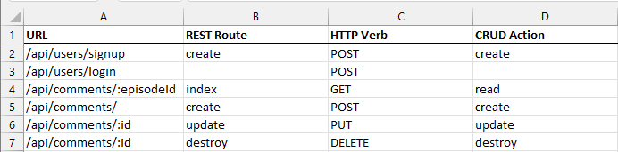
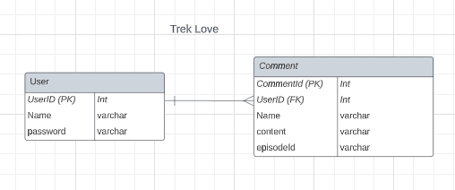
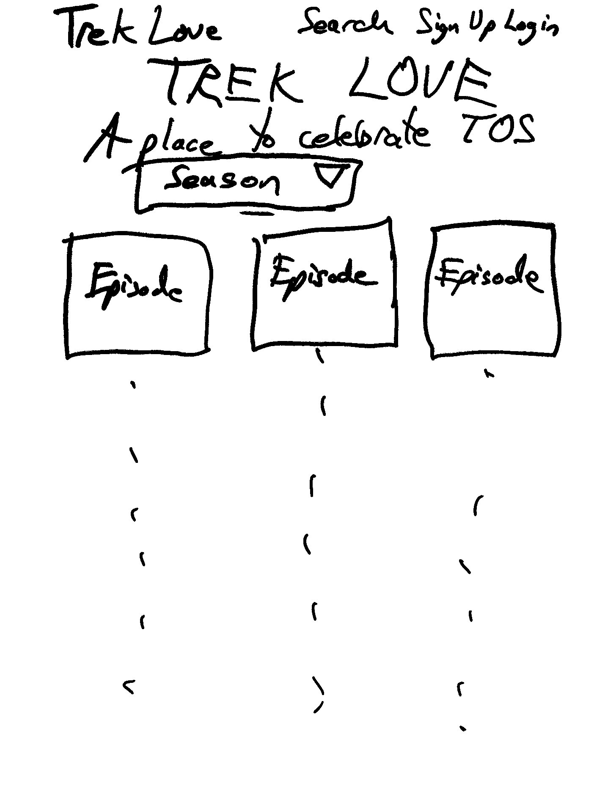
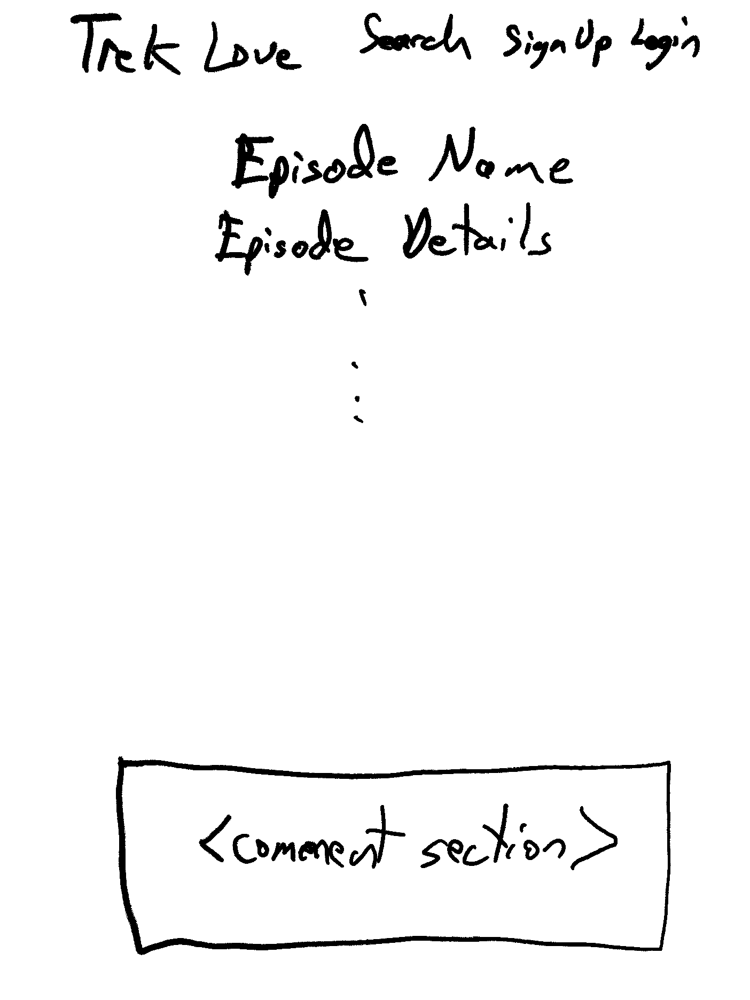
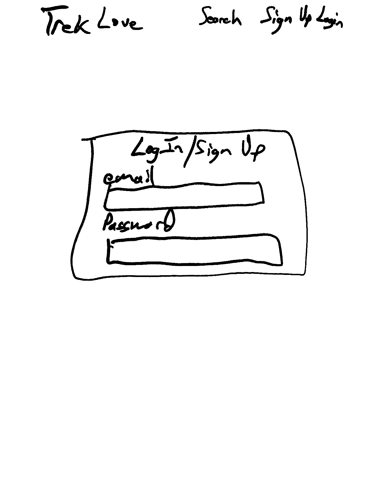
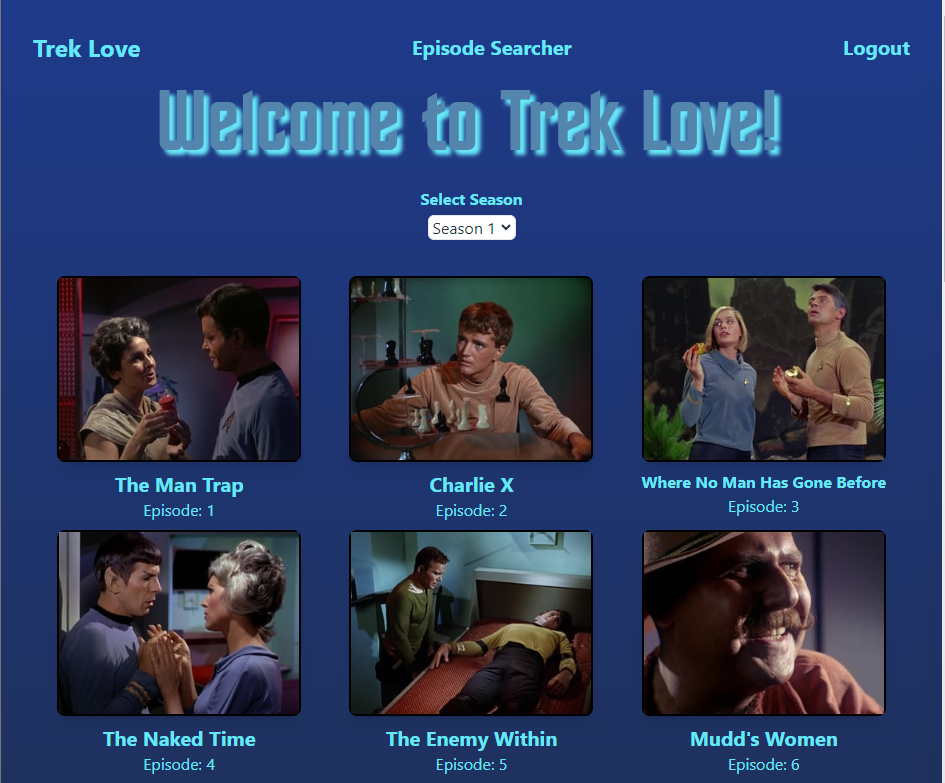
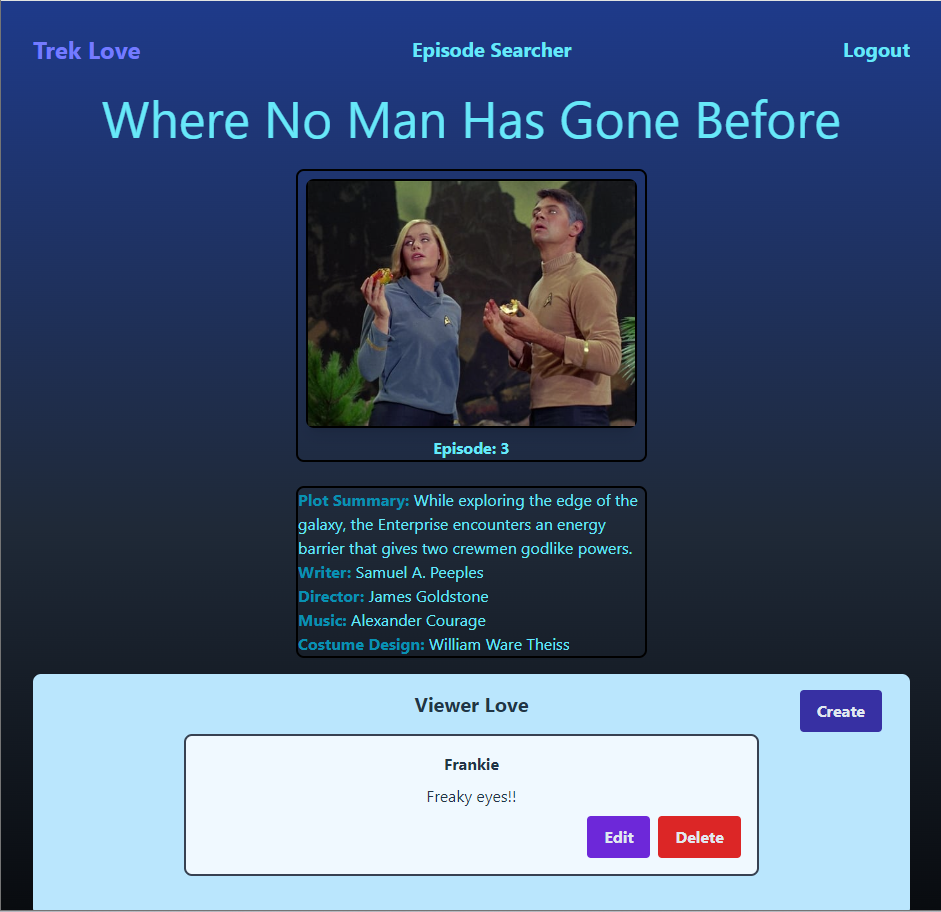
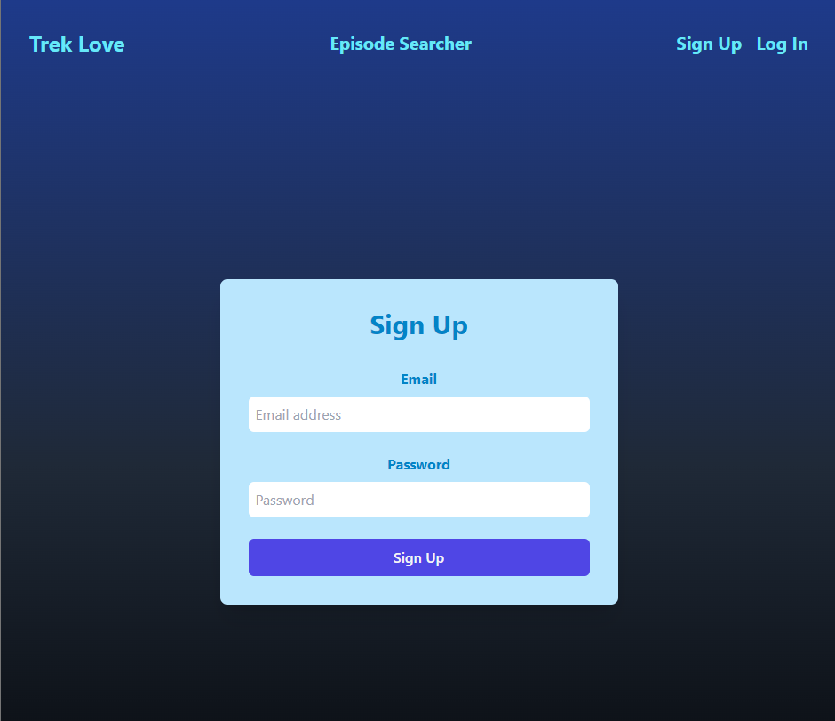
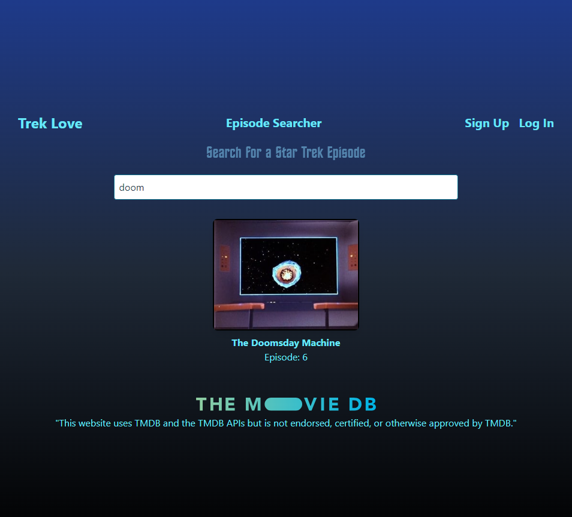
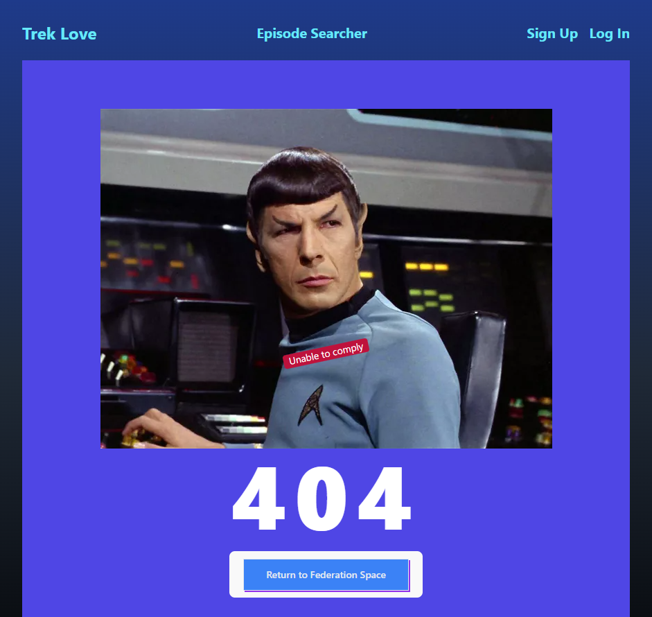

# TREK LOVE
MERN fullstack application with full CRUD and JWT implementation.

### Heroku link

[Trek Love](https://trek-love-402634987769.herokuapp.com/)

### Technologies used

* Express
* React
* Mongoose
* Method-override using Axios
* Cors
* dotenv
* jwt-simple
* Tailwind (CSS)

### CRUD Table



### Entity Relationship Diagram


### Installation Instructions for running locally

#### Run the following:

* npm init -y
* npm i  

#### Add the following to the .gitignore file

* node_modules
* .env

#### You must request an API key from TMDB

[TMDB](https://developer.themoviedb.org/reference/intro/getting-started)

#### You must have your own MongoDB Atlas account with a valid connection URI pointing to a suitably named database, i.e. trek-love.

#### Add and initialize the following global variables in the .env file:

* VITE_TMDB_API_KEY
* MONGODBURI
* PORT
* JWT_SECRET_KEY

PORT is for the MongoDB port. Default is typically 3000.

JWT_SECRET_KEY can be anything you like.


### User stories

* As a user, I want to view a gallery of episode cards for Star Trek: The Original Series.
* As a user, I want to be able to change the cards displayed in the gallery, based on season.
* As a user, I want to be able to click on an episode card a see details about that episode.
* As a user, I want to signup as an authorized user so that I can add my comments on the episode detail page.
* As an authorized user, I want to use my previously established credentials to login, so that I can make comments.

### Wireframes

\
\
\


### Screenshots

\
\
\
\


### Learnings

1. I learned the basics of how to work with the React framework for creating SWP applications. 
    1. Declaring state variables using the useState() hook.
    2. Lifting state variables (or their setter functions) up the component tree and/or passing them down the component tree, via props. 
    3. Using the useEffect() hook to manage actions when state variables (or props) are changed.
2. I learned how to use the Routes, Route, and Link React components to manage navigation throughout the SWP application.
3. I learned how to use the useNavigate() hook to programmatically manage navigating to a particular page in the SWP application.
```
import { useNavigate } from 'react-router-dom';

const navigate = useNavigate();

navigate('/details')
```
4. I learned how to use the JS setTimeout() method in combination with a React hook to delay when the hook action is taken:
```
setTimeout(() => navigate('/details'), 800);
```
5. I learned how to use the useRef hook to activate an HTML audio component:
``` 
import { useRef } from 'react';
import audioPath from "../../assets/tos-turboliftdoor.mp3"

// Declaring the hook
    const audioRef = useRef();
    
// Using the hook
audioRef.current.play();
    
// JSX
<audio id="door_audio" ref={audioRef}>
    <source src={audioPath} type="audio/mpeg" />
</audio>

```
More about useRef hook from ChatGPT:

&nbsp; &nbsp;The useRef hook in React is used to create mutable object properties that persist across renders without causing re-renders when they are modified. Unlike the state, changing the value of a ref doesn't trigger a re-render of the component.

6. I learned how to get around undesirable state batching using a functional update. 

&nbsp; &nbsp;This was needed because, although I was able to get all of the data I needed in a single API call, it was nested within multiple elements, requiring additional logic to assemble it into a single, cohesive set of useable data. Accordingly, without the functional update logic, the episodes state variable array was not getting properly initialized, because state batching was holding off the multiple consecutive updates to the state variable array.
```
let i = null
for (i = 1; i < 4; i++) {
  let strSeason = `season/${i}`
  // Had to use a functional update in order to get the data
  // correctly loaded into the array. Otherwise, the state
  // variable wasn't getting updated correctly because 
  // the state updates were being batched.
  setEpisodes(prevEpisodes => [...prevEpisodes, ...data[strSeason].episodes]);
}  
```
7. I learned that a JSX function can return one, and only one, HTML expression. Accordingly, when I added some conditional logic to a JSX expression that needed to return two React/HTML elements, I needed to enclose both of them in blank tags. In the same use case, I also learned how to use a ternary JSX expression:
```
{/* Conditional logic to show/hide links to 
Signup/Login or Logout */}
{loggedIn ? (
    <a href="" onClick={logout} className="text-cyan-700 font-bold text-xl">Logout</a>
) : ( 
<>
  <Link to="/auth/signup" className="text-cyan-700 font-bold text-sm">
    <h4>Sign Up</h4>
  </Link>
  <Link to="/auth/login" className="text-cyan-700 font-bold text-sm">
    <h4>Log In</h4>
  </Link>
</>
)}
```
8. I learned how to implement JWT for user authentication, i.e. Signup/LogIn.

* jwt.config.js
```
require('dotenv').config()

module.exports = {  
    jwtSecret: process.env.JWT_SECRET_KEY,
    jwtSession: {
        session: false
    }
}
```

* comments.js controller file

    
```
/* Require the JWT config
--------------------------------------------------------------- */
const config = require('../../jwt.config.js')

/* Middleware that checks if a JWT sent from the client is valid.
   Used for all routes that require authorization
--------------------------------------------------------------- */
const authMiddleware = (req, res, next) => {
    // Check if the 'Authorization' header is present and has the token
    const token = req.headers.authorization;
    if (token) {
        try {
            // Decode the token using the secret key and add the 
            // decoded payload to the request object
            const decodedToken = jwt.decode(token, config.jwtSecret);
            req.user = decodedToken;
            next();
        } catch (err) {
            // Return an error if the token is invalid
            res.status(401).json({ message: 'Invalid token' });
        }
    } else {
        // Return an error if the 'Authorization' header is missing or has the wrong format
        res.status(401).json({ message: 'Missing or invalid Authorization header' });
    }
};
```

### Todos

* Refactor app so that userToken is stored in a state variable inside App component (in addition to being in localStorage). Then pass in that userToken into functions in frontend/utils/backend.js that require authHeader info.
* Add labels to menu to display email of logged in user.
* Conditionally display AuthFormPage component only if there is no logged in user, i.e. Show/Hide authform based on state variable "loggedIn".